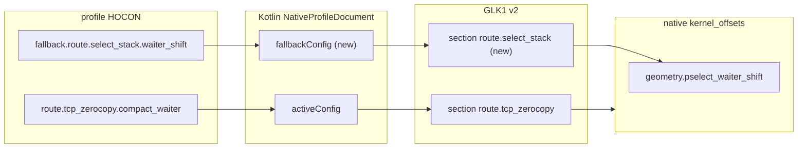

# fallback route 专属参数进入 GLK1 计划（2026-09-27）

> L 级改动：wire v2 profile 契约 + 跨 Native↔Kotlin。按 `engineering-standards.md` §1.2，
> 本文先于代码；获认可后再实施。模板见 `documentation-standards.md`。

## 现状与基线

- fallback 派发已是 native 通用逻辑（`src/core/route/route_policy.hpp:237-249`）：主 route
  以 `ROUTE_FALLBACK_SAFE` 干净失败且 profile 声明了 fallback 时，按
  `profile.fallback_route()` 调 `run_policy_by_kind`。fallback 的 select 分支在
  `src/core/route/select_stack_route.cpp:507` 读 `profile.select_stack_layout()`，即
  `geometry.pselect_waiter_shift`（`src/core/profile/model.h:118-124`）。
- wire v2 只承载单一 route 段：
  - native `parse_v2` 只接受 `route_section_name(out->route)` 的段
    （`src/core/profile/binary.cpp:297-307`）；
  - native `serialize` 只写 active route 段（`src/core/profile/binary.cpp:347-352`）；
  - Kotlin 解码只应用 active route 段（`NativeProfile.kt:325-329`），构建只构造 active
    route 的 config（`NativeProfile.kt:348`）。
- profile 声明层已经支持 fallback：
  - `ProfileResolver.nativeValue` 会把 branch/mcast 字段回退到
    `fallback.route.<name>.<field>`（`profile-core/.../ProfileResolver.kt:49-71`）；
  - TB375FC `6.1.138-android14-11-g151cf2b6bfbe-ab13719792.conf:13-20` 声明
    `fallback.to = select_stack` 与 `fallback.route.select_stack.waiter_shift = 1`。
- 缺口：主 route 为 `tcp_zerocopy`、fallback 为 `select_stack` 的 profile，GLK1 里没有
  任何段承载 fallback 的 `waiter_shift`，native fallback select 拿到空
  `pselect_waiter_shift`。这是本次要关闭的合并阻塞。

## 目标与约束

目标：

1. wire v2 同时携带 active route 段与 fallback route 段；native 解析时两段都应用到同一个
   `kernel_offsets`（`geometry` / `execution`）。
2. Kotlin 编码与解码同步处理两段，`ProfileExporter` 无需额外分支。
3. TB375FC 这类 profile 的 fallback 专属参数真正到达 native。

非目标（明确不做）：

- 不新增或叠加 wire 版本号，仍在 v2 内扩展 section 语义。
- 不改 route 段字段表、`kRouteCatalog` 与 route 私有参数键名。
- 不改攻击阶段、waiter/PI 生命周期、任何攻击写入顺序。
- 不支持多于一个 fallback（`route_policy.hpp` 只取单个）。

约束与不变量：

- 主 route 与 fallback route 必须不同；相同由 `route_policy.hpp:241` 忽略，wire 也不写重复段。
- 同名字段（`compact_waiter`）两段都映射同一 native 成员；两段一致由 profile 保证，
  解析顺序后者胜出，可接受。
- 缺失 fallback 段等价于"fallback 专属参数未提供"，不是错误。

## 改动清单（逐文件）

### Native

| 文件 | 改动 | 理由 |
|---|---|---|
| `src/core/profile/binary.cpp` | `parse_v2` 改为两遍：先解析并应用非 route 段（含 `meta.fallback_route`），缓存 route 段入口；再应用名字等于 active 或 fallback route 的段。`serialize` 的段过滤改为"active 或 `meta.fallback_route`"，两者不同才写 fallback 段 | 承载并落盘 fallback geometry，其余 route 段仍旧忽略 |
| `src/core/tests/profile_binary_test.cpp` | 新增 active=tcp + `fallback_route=select` 的文档设置 `pselect_waiter_shift` 断言；把现有"another section is ignored"改为"既非 active 也非 fallback 的段被忽略"；round-trip 覆盖两段 | wire 固定向量 |

### Kotlin / profile-core

| 文件 | 改动 | 理由 |
|---|---|---|
| `profile-core/.../data/NativeProfile.kt` | `NativeProfileDocument` 加 `fallbackConfig: RouteConfig`（默认 `NoRouteConfig`）；`from()` 用 `RouteKind.fromToken(fallbackTo)?.buildConfig(value)` 构建；`toBinary()` 在 active 段后写 fallback 段（非空且与 active 不同）；`fromBinary()` 先把 `route.*` 段缓存，再按 header route 与 `meta.fallback_route` 应用 | 双侧字段表/段语义一致 |
| `app/.../data/Profile.kt` | `pselectWaiterShift`、`multicast` 等按 active 优先、fallback 兜底取 config | UI/校验看到 fallback 参数 |
| `profile-core/.../profile/ProfileResolver.kt` | 无需改：`nativeValue` 已读 `fallback.route.*` | 复用现有解析 |
| Kotlin 测试 | `NativeProfileDocumentTest` 加双段 round-trip；`ProfileResolverTest`/`ProfileExporterTest` 覆盖 TB375FC fallback 值 | 防回归 |

## 数据流/控制流差异

控制流不变量：

- `run_route` 的选择与 fallback 顺序不变（仍是 clean 失败才 fallback）。
- native 对"既非 active 也非 fallback"的 route 段仍完全忽略，不静默合并。

## 兼容性与回滚

- 旧文档（仅 active 段）：fallback 段缺失 → 行为与今天相同（fallback 无 geometry），不崩。
- 新文档 + 旧 native：旧 native 只认 active 段 → fallback 参数丢失，但不崩溃。本分支
  Kotlin 与 native 同版本发布，不做旧 native 兼容。
- 回滚：还原两侧 commit 即可；wire 无新版本号，无数据迁移。

## 验证矩阵

| 批次 | 命令 | 预期 |
|---|---|---|
| 1 Native | `make -C src native-host-tests` | 新增双段固定向量通过 |
| 2 Kotlin | `./gradlew :app:testDebugUnitTest` | 双段 round-trip、TB375FC fallback 值通过 |
| 3 导出 | `./gradlew exportKernelProfiles` | TB375FC `.bin` 含 `route.select_stack` |
| 4 构建 | `./gradlew :app:assembleDebug` + `make -C src ghostlock` | 零警告 |
| 5 真机 | 冷机 TB375FC route tcp→fallback select 门禁 | route 命中、fallback_used、写验证通过（若设备可用） |

## 明确保留

- `src/core/kernelsnitch/**`、`LegacyProfileConverter.kt` 的 v1 转换。
- route 段字段表、`kRouteCatalog`、`.conf` 中的键名与顺序。
- 攻击阶段与资源回收顺序（本计划不触攻击关键路径代码）。

## 进度

- [ ] Native parse/serialize 两段
- [ ] native `profile_binary_test` 更新
- [ ] Kotlin 编解码两段
- [ ] Kotlin 测试
- [ ] 导出验证
- [ ] 真机门禁（若设备可用）
