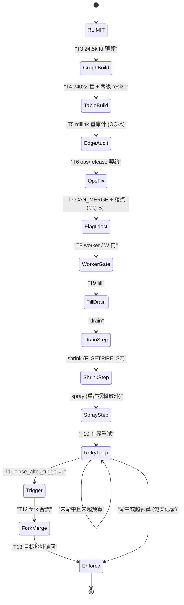
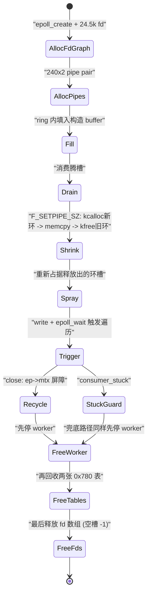
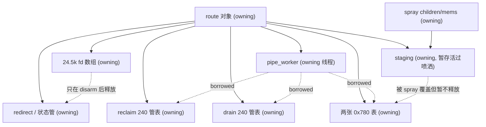

# fd_graph REAL INJECT 分批实施计划（L 级）

**状态：待用户评审。评审通过前不得改动攻击关键路径代码。**

- 目标设备：vivo X300 Pro，`uname -r` = 6.12.58（`PROFILE-61258-*` 系列）
- 父批次：`docs/development/61258-fdgraph-primitive-plan.md` §1.1（路由族 D 路线：synthetic reclaim/drain）
- 本文档性质：**设计计划**，不是实现记录。本文档产出后进入用户评审；评审通过后才允许进入 T3 及之后的实现批次。
- 基线（所有批次共用，不得漂移）：
  - commit：`e032c88`
  - 二进制：`build/native/ghostlock.baseline-20261004-162958`
  - SHA-256：`9aa1a70a829dfabfbafa86b786560e80f0d74b9ecc7ade188ed43a6ab51942ff`
  - `tools/cmp_disasm.py` 判定：PASS（6 IDENTICAL + 2 STALE）

---

## 1. 动机与上游修正

### 1.1 当前状态

门禁 `-13`（`PROFILE-61258-13-20261004-interleave-FAIL.md`）与 `-14`
（`PROFILE-61258-14-20261004-fork-redirect-FAIL.md`）已把 `fd_graph` 的**资源生命周期**跑到
可回收状态：24.5k fd 预算、240 组 pipe pair、small/expand 两级 resize、fork redirect、
240 次 write 与有界回收均成功，`chain_hits=0`，**但目标地址始终未被写入**。

现有实现中以下三处是"自证式"证据，**不构成内核命中证明**：

| 现有机制 | 当前行为 | 为什么不能算 PASS |
| --- | --- | --- |
| `GENMARK0` | 写入用户态 staging 后自读回 | 回读的是自己写的字节，不经过内核 |
| bit4 / `CAN_MERGE` | 在 staging 内设置并读回 | 同上，未验证 `pipe_write` 真的合并 |
| command gate | self-pipe 自测 | 只证明 write(2) 通，不证明落到目标页 |

`docs/analysis/fd-graph-primitive-scoping.md` §2.7–§2.19 已把指令级依据拆开，本文只做
"哪个修正落在哪个批次"的映射，不重复推导。

### 1.2 源码核验基线（Linux v6.12，本文新增）

以下偏移/语义在本次评审前已对上游源码逐条核对，是本文所有数值主张的依据。

**`struct pipe_buffer`**（`include/linux/pipe_fs_i.h:26-32`）：

| 字段 | 偏移 | 备注 |
| --- | --- | --- |
| `page` | `0x00` | `pipe_write` 合并时的写入落点 |
| `offset` | `0x08` | 落点 = `page + offset + len` |
| `len` | `0x0c` | |
| `ops` | `0x10` | **`const struct pipe_buf_operations *`；无 NULL 保护地被解引用** |
| `flags` | `0x18` | bit4 = `PIPE_BUF_FLAG_CAN_MERGE (0x10)` |
| `private` | `0x20` | |
| `sizeof` | `0x28` | 与上游日志 `pipe_ring=0x500 = 32 × 0x28` 自洽 |

**`struct epitem`**（`fs/eventpoll.c:131-172`，偏移按 x86_64 推导）：

| 字段 | 偏移 | 用途 |
| --- | --- | --- |
| union `rbn` / `rcu` | `0x00` | RB 树 / RCU 释放 |
| `rdllink` | `0x18` | **ready list（`ep->rdllist`）链接边** |
| `next` | `0x28` | 溢出链表 `ep->ovflist`（单链 LIFO） |
| `ffd` | `0x30` | `file` + `fd` |
| `dying` | `0x40` | |
| `pwqlist` | `0x48` | |
| `ep` | `0x50` | |
| `fllink` | `0x58` | `file->f_ep_links` hlist 边，**不是 ready list** |
| `event` | `0x70` | |

**遍历边判定（决定性）**：`rdllink` 在 `eventpoll.c:745/1350/1722/1798/1899` 被
`list_add*` 进 `ep->rdllist`，在 `eventpoll.c:963`（`ep_send_events`）与 `1842`
（`ep_send_events_proc`）由 `list_for_each_entry_safe(..., rdllink)` 遍历；
`fllink` 只出现在 `hlist_add_head_rcu`(1609) / `hlist_del_rcu`(834) /
`hlist_for_each_entry_rcu`(1506) / `container_of`(304) 一组 file-items 路径上。
**`ep_send_events` 从不触碰 `fllink`。**

**poison 语义**（`include/linux/list.h`）：

- `list_del()`：`next = LIST_POISON1 (0x100)`、`prev = LIST_POISON2 (0x122)`。
- `list_del_init()`：`__list_del_entry()` + `INIT_LIST_HEAD()` → **自环，不投毒**。
  eventpoll 对 `rdllink` 的移除（842/974/1865）**全部**走 `list_del_init`。
- `list_replace()`：`new->next = old->next; new->next->prev = new; new->prev = old->prev; new->prev->next = new;`
- `list_replace_init()`：`list_replace()` + `INIT_LIST_HEAD(old)` → 自环，不投毒。
- `list_for_each_entry_safe` 沿 `pos->member.next` 前进 ⇒ **被劫持的 `next` 是加载边**；
  `prev` 只在 `__list_del_entry` 的回链写 `next->prev = prev; prev->next = next` 中起作用。

### 1.3 上游三组修正

#### 修正 A — 生命周期顺序：alloc-then-free 与 fill → drain → shrink → spray

- `pipe_resize_ring()` 是 `kcalloc(新环) → memcpy 占用项 → kfree(旧环)`，即
  **先分配后释放**；释放出的旧环尺寸 = 旧槽数 × `0x28`。
  - 收缩到 2 槽：释放 `0x50`；扩容到 32 槽：释放 `0x50`，占用 `0x500`。
  - 默认 16 槽 = `0x280`。
- 因此"回收出可被我们内容覆盖的 `pipe_buffer[]` 形状区域"的顺序必须是
  **fill（把内容放进环）→ drain（消费掉，腾出槽）→ shrink（`F_SETPIPE_SZ` 释放旧环）→ spray（重新占据释放出的槽）**。
- **门禁 `-13` 实测的 `reclaim_small → spray → reclaim_expand` 顺序不能当作真实注入顺序**，
  它的价值是证明了 fd 预算与回收链，不是证明了注入时序。

#### 修正 B — 遍历边：`epitem.rdllink`，不是 `fllink`

- 见 §1.2：`ep_send_events` 只走 `rdllink`（`0x18`）。
- 当前 profile 的 `epitem_fllink` + `base | 0x108` 指向的是**另一个结构体的另一个字段**
  （`fllink` 在 `0x58`，且不是 ready list 边），**不能继续作为决定性机制**。
- 处置：`base | 0x108` 与 `epitem_fllink` 的组合从计划中**移除决定性地位**；
  `rdllink` 的取值由结构定义推导（`epitem + 0x18`），**不新增 wire 字段、不 bump 版本**。

#### 修正 C — 载入条件：`ops->release` 强于 `CAN_MERGE`

- `pipe_write` 的合并条件**只有** `(buf->flags & PIPE_BUF_FLAG_CAN_MERGE) && offset + chars <= PAGE_SIZE`，
  随后 `copy_page_from_iter(buf->page, offset + buf->len, chars, from)`
  —— 真正的写入落点是 `buf->page + offset + len`。
- 但同一条路径上 `pipe_buf_confirm()` **无条件解引用 `buf->ops->confirm`**，
  回收期 `pipe_buf_release()` 同样解引用 `ops->release`。
- 结论：**`CAN_MERGE` 只是"能不能落进去"，`ops`/`release` 是"会不会崩"。**
  只置 bit4 而 `ops` 为 NULL → NULL 解引用 panic；`ops` 指向伪造结构 → 回收期任意函数调用。
  ⇒ **批次顺序必须先修 `ops`/`release`，再上 `CAN_MERGE` 落点。**
- 同时：**staging 中的 bit4 自读回永远不是 PASS**，必须以目标地址读回或
  `epoll_wait` 行为变化作为判据。

#### 未决项（OQ，必须在对应批次内以实验收敛，不得在本文预设答案）

| OQ | 问题 | 为什么现在不能答 | 最便宜的决定性探针 |
| --- | --- | --- | --- |
| OQ-A | 被劫持的 `rdllink.next` 应写成什么（`base + 0x100` / `base + 0x122` / 其它） | `LIST_POISON2 = 0x122` 是**上游日志观测值**，而 eventpoll 的 `rdllink` 拆除走 `list_del_init`（自环，无毒），因此 `0x122` **必然来自另一个对象的 `list_del()` 拆除路径**，该对象身份尚未定位 | 准备一个 ready event，在候选构造间做**只读 `epoll_wait` 遍历探针**，以返回 fd 集/异常变化为判据；禁止用 staging 自读回代替 |
| OQ-B | 上游 `0x166` 处读回测 bit4 的落点对象是谁 | `0x166 - 0x18 = 0x14e` 既非页对齐也非 slab 对齐，故它**不像**是在读环数组槽的 `flags`，更像在被投毒遍历目标的内部字节 | 在 `0x166` 与环槽基址两个候选上分别只读比对；命中环槽则 `SHAPE` 成立，否则记为投毒目标内部偏移 |
| OQ-C | direct-map W1 目标页如何取得（上游是文件页，GhostLock 需要内核页） | 上游 carrier 是"order-3 skb frag 释放后回到文件 page cache 再 `mmap`"，与 W1 的内核地址不是同一类对象 | 沿用 kernelsnitch 已知内核页做基址（参考日志已出现 `carrier=reclaim_skb` → 文件槽的 `release`），逐候选做**目标地址写后读**判定 |

---

## 2. 影响文件

计划涉及（**当前一律不改，见状态头**）：

| 文件 | 预期改动 |
| --- | --- |
| `src/core/route/fd_graph_route.cpp` | 执行顺序改为 `fill → drain → shrink → spray`；`ops` 构造；`CAN_MERGE` 落点；真实目标页获取；重试环与 close 顺序 |
| `src/core/route/fd_graph_route.h` | `pipe_worker` 生命周期接口；`consumer_stuck` 计数/兜底；两表成员 |
| `src/core/support/native_resource.hpp` | 新增 `BulkFdArrayOwner`（当前仅有 `BulkFdOwner`） |
| `src/core/tests/fd_graph_route_test.cpp` | 顺序/生命周期/边界用例 |
| `docs/kernel_profiles/PROFILE_SCHEMA.md` | **仅在 `rdllink` 语义需澄清时**补说明文字；不改字段表 |

**不在范围内**：wire/profile 格式（`FdGraphLayout` 已确认 16 字段，**不加字段、不 bump 版本**）、
`src/core/profile/model.h`、Kotlin 侧任何文件、`LegacyProfileConverter.kt`、golden 二进制。

**明确保留**：`select_stack`、`tcp_zerocopy`、`multicast`、`kernelsnitch-6x.conf`、
`credential-6x.conf`。

---

## 3. 分批方案（T3–T14）

### 3.1 修正 → 批次映射（先看这张表）

| 修正 | 落在批次 |
| --- | --- |
| A（alloc-then-free / fill→drain→shrink→spray） | T3、T4、T9、T10 |
| B（`rdllink` 取代 `fllink`） | T5 |
| C（`ops`/`release` 先于 `CAN_MERGE`） | T6、T7 |
| OQ-A / OQ-B / OQ-C | T5、T7、T8 |

### 3.2 批次表

每个批次**只做一类事**，单变量；上一批验证通过才进下一批。

| 批次 | 目标 | 单变量 | 通过判据 |
| --- | --- | --- | --- |
| **T3** | RLIMIT 预算与 24.5k 图 | `RLIMIT_NOFILE` 抬到满足 `cur >= current + 0x60a0`（当前实现接近绝对 `0x60a0`，按参考语义改正并记录偏差） | 24.5k fd 全部建立成功，无 `EMFILE` |
| **T4** | 240 组 pipe + 两级 resize | 建立 reclaim/drain **两张独立 240 管表**（当前是单管读端别名 reclaim、写端别名 drain） | 两表各 240 管；`pipe_ring` 尺寸与 `0x28` 乘数自洽 |
| **T5** | `fake_fllink` 重审计 + `GENMARK0` | 把 `base \| 0x108`/`epitem_fllink` 的决定性地位移除，改为按 `epitem + 0x18` 推导 `rdllink`；**OQ-A 探针**只读验证 | 只读 `epoll_wait` 探针给出可解释结果；`rdllink` 取值有证据或明确记为未决 |
| **T6** | `ops` / `release` 正确性 | 构造可被 `pipe_buf_confirm` / `pipe_buf_release` 安全解引用的 `ops`，`confirm == NULL`、`release` 可调用 | 无 NULL 解引用；回收期无异常调用 |
| **T7** | bit4 / `CAN_MERGE` 数据构造 | 在 `+0x18` 置 `CAN_MERGE`，并按 `+0x10` 的 `ops` 契约对齐落点；**OQ-B** 判定 `0x166` 落点对象 | **目标地址读回**变化；禁止 staging 自读回 |
| **T8** | worker / W 门 | `pipe_worker` 只在 W1 完成后停止；建立 `consumer_stuck` 兜底 | worker 停止先于 free；无卡死 |
| **T9** | 240 write + `pread64` | 按 `fill → drain → shrink → spray` 顺序实装；240 次写 + `pread64` 回读 | `pread64` 在目标地址读到构造值（`ESPIPE` 视为失败信号并记录） |
| **T10** | 重试环 | 有界重试，失败即停 | 重试次数有上限；`chain_hits=0` 保持诚实记录 |
| **T11** | close 顺序 | 保留 `close_after_trigger=1`；`ep->mtx` 作为 epoll close/free 与控制面操作的同步屏障不可绕过 | 顺序符合 §4 表 |
| **T12** | fork 合流 | `-14` 已通过的 redirect 不回退 | 240 write 完成且有界回收干净 |
| **T13** | enforce 验收 | 真实写入判定取代自证式判据 | 目标地址读回 + W1 语义成立 |
| **T14** | lifecycle 终审 | 按 §4 表逐行复核所有权/UAF/终结点 | 8 行全部有实现对应点 |

### 3.3 攻击阶段机



### 3.4 `fd_graph` 生命周期



### 3.5 资源所有权



---

## 4. 所有权与生命周期审查表

Rust 式所有权追踪；每个对象列"取得 / 所有者 / 借用者 / 访问区间 / 终结点 / 释放者"。
**UAF 例外仅限 `pipe_buffer` 槽**（作为漏洞原语被有意劫持），不得扩展到辅助对象、
race 状态、waiter、缓冲区、映射或同步资源。

| # | 对象 | 取得 | 所有者 | 借用/访问者 | 访问区间 | 终结点 | 释放者 | 约束 |
| --- | --- | --- | --- | --- | --- | --- | --- | --- |
| 1 | 24.5k fd 数组 | `epoll_create1` + 逐个登记 | route | `pipe_worker` | 建图 → 触发完成 | disarm 之后 | `BulkFdArrayOwner` | 空槽置 `-1`；先停 worker 再释放 |
| 2 | `pipe_worker` | 线程创建 | route | 自身执行 T8–T10 | 启动 → 触发完成 | **必须早于所有被它借用的资源** | route（join 后） | `consumer_stuck` 时走兜底，同样先 join |
| 3 | reclaim 240 管表 | `pipe2` ×240 | route | `pipe_worker` | T4 → T9 | 表回收之后 | route | 与 drain 表严格配对回收 |
| 4 | drain 240 管表 | `pipe2` ×240 | route | `pipe_worker` | T4 → T9 | 表回收之后 | route | 不得与 reclaim 表共享 fd |
| 5 | 两张 `0x780` 表 | 建表阶段 | route | `pipe_worker`、spray | T4 → T14 | worker 停止之后 | route | 覆盖 `pipe_ring=0x500` 尺寸算术的前提，须与设备实际 `sizeof(pipe_buffer)` 对齐 |
| 6 | staging | 用户态映射 | route | 构造逻辑 | 建表 → 喷洒 | **暂存活过喷洒** | route | 提前释放会造成写入已释放映射（UAF） |
| 7 | spray children/mems | `clone` / 映射 | route | 喷洒逻辑 | T9 单轮 | 该轮结束即回收 | route | 轮次边界回收，不得跨轮持有 |
| 8 | redirect / 状态管 | `pipe2` | route | 主流程、`pipe_worker` | 建图 → 合流 | 合流完成后 | route | `close_after_trigger=1` 不得早退绕过 |

**既有顺序不得因重构改变**：参与者停止访问 → 同步/解除关联 → 资源回收。
历史上曾因重构漏回收 PI 内存导致 panic；本批次涉及 PI 内存位置与 waiter 时序，
须在 §5 门槛中逐条复核。

---

## 5. 验证计划

### 5.1 每个批次都要跑（普通门槛）

```sh
make -C src native-host-tests     # 主机单元测试
make -C src ghostlock             # NDK 构建，零新增警告
make -C src lint-tidy             # clang-tidy，0 findings
./gradlew :app:testDebugUnitTest # app 单测
./gradlew exportKernelProfiles   # golden 不应变化
```

`FdGraphLayout` 仍为 16 字段；若 `exportKernelProfiles` 产出发生变化即视为越界。

### 5.2 攻击关键路径门槛（T3 及之后全部批次）

1. **反汇编核对**：`python3 tools/cmp_disasm.py build/native/ghostlock.baseline-20261004-162958 build/native/ghostlock`
   要求 8 个攻击函数 IDENTICAL (strict)，或仅有已复核并注解的差异。
   字节差异若无法证明不影响"攻击代码与资源准备/回收之间的相对顺序"这一不变量，
   **停止该批次并调查**，不以测试通过替代反汇编核对。
2. **真机门禁**：冷机、固定 CPU 对、单 route、KernelSU 未加载的干净启动。
3. **日志归档**：设备 `Download/ghostlock-debug-log/<时间>/*.log.txt`
   （同目录 `profile.conf` / `profile.bin`），按
   `docs/development/documentation-standards.md` 的门禁模板归档到
   `docs/analysis/device-gates/`。

### 5.3 判定纪律

- staging 自读回、`bit4` 自读回、self-pipe command gate **一律不算 PASS**。
- PASS 只能是：目标地址读回发生变化，或 `epoll_wait` 行为变化（OQ-A 探针）。
- `chain_hits=0` 必须如实记录，不得因流程跑完而写成命中。

---

## 6. 风险与停止条件

| 风险 | 表现 | 处置 |
| --- | --- | --- |
| `KERNEL-PANIC-01`（已知环境/时序问题） | 同构建可 PASS/panic/PASS | 归因需**同构建复现 + 冷机复跑**；不得凭单次 panic 归因代码 |
| `ops` 未修先上 `CAN_MERGE` | NULL 解引用 panic | 批次顺序强制 T6 先于 T7；顺序倒置即停 |
| `SHAPE` 不符 | 环槽尺寸/字段偏移与算术不符 | 停止批次，回到 §1.2 重新核验 `sizeof(pipe_buffer)` 与槽基址 |
| `OPERAND-DIFF` | 读回值与构造不符 | 停止批次，记录原始日志，不进入下一批 |
| 误把 `fllink` 当 ready list | 探针无解释性结果 | 回到 §1.2；`rdllink`（`0x18`）为唯一 ready-list 边 |
| `0x122` 来源误判 | 把日志观测值当设计值 | `0x122` 仅作诊断签名（命中即知遇到 `list_del()` 投毒头），不作为写入目标 |
| OQ 未收敛就实装 | 批次无法判定 | 相关批次停在探针阶段，不允许"先写着以后调" |

---

## 7. 评审要点

请评审者逐条确认：

1. **修正 A**：`fill → drain → shrink → spray` 是否为 6.12 上的正确顺序？`shrink` 释放的旧环尺寸（槽数 × `0x28`）是否与 OQ-B 的 `0x166` 读回位置自洽？
2. **修正 B**：确认弃用 `epitem_fllink` + `base | 0x108`，改用 `epitem + 0x18` 的 `rdllink`；且**不新增 wire 字段**。这一判断已由 `fs/eventpoll.c:963/1842` 源码核对支撑，请确认是否接受。
3. **修正 C**：确认"`ops`/`release` 强于 `CAN_MERGE`"的排序，并接受 T6 先于 T7 的强制顺序。
4. **OQ-A / OQ-B / OQ-C** 是否可接受"先只读探针、后实装"的处理方式；探针判据是否够便宜、够决定性。
5. **§4 的 8 行所有权表**是否覆盖完整；特别是 staging 暂存活过喷洒、`pipe_worker` 先停后释、`consumer_stuck` 兜底路径。
6. **§5 判定纪律**是否足够严格（禁止三类自证式判据）。
7. **T3–T14 的批次切分**是否满足"一个批次只做一类事"；有无批次可以合并或必须进一步拆分。
8. **明确保留清单**与"不加 wire 字段、不 bump 版本"是否与父批次 `61258-fdgraph-primitive-plan.md` §1.1 一致。
9. 本批次是否需要先补齐 §1.2 中 `pipe_buf_confirm` / `pipe_buf_release` 的逐行引用（当前结论来自函数语义而非行号摘录）。

评审通过后，按 T3 → T14 顺序推进，每批独立门禁、独立归档。