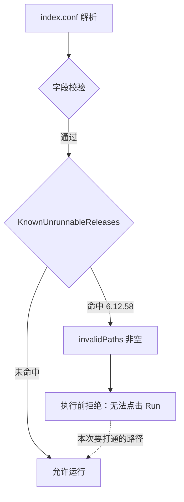
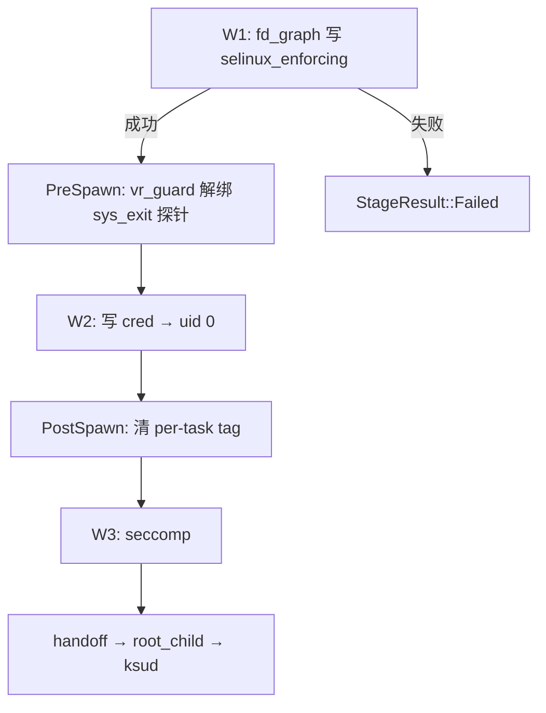

# 6.12.58 fd_graph W1 门禁计划（2026-10-03）

## 现状与基线

- 分支 / commit：`main` @ `c718f31`（merge `upstream/main`）
- 设备：vivo X300 Pro（V2514，MTK6993），`uname -r` = `6.12.58-android16-6-gff10eaa8f8a4-ab15575650-4k`
- profile：`app/src/main/assets/kernel_profiles/6.12.58-android16-6-gff10eaa8f8a4-ab15575650-4k.conf`，已在 `index.conf` 注册，`route` = `fd_graph`

### 当前行为：profile 可解析但被拒绝运行

`app/src/main/kotlin/com/ghostlock/app/data/AndroidProfileConfigController.kt` 的
`KnownUnrunnableReleases`（第 879-889 行）把该 release 映射为一条拒绝理由，经
`invalidPaths` 交给既有的执行前拒绝逻辑，UI 显示原因但不提供 Run。



### 已知问题

1. **拒绝理由已过期。** 该理由写「三条 W1 route 全部阻塞」，逐条列出 `select_stack`、
   `tcp_zerocopy`、`multicast_waiter`。但 `aed09ad` 随后新增了第四条 route
   `fd_graph`，并且本 profile 的 `route` 块现在正是 `fd_graph`。`gate` 从未在该提交后重新评估。
2. **该 gate 正好挡住 `fd_graph` 唯一的验证手段。** 不解除就无法在真机上跑 `fd_graph`。
3. **12 个 `fd_graph` 几何常量来自 `preload.so` 的 `.rodata`**，不是从本机内核推导的。
4. **物理地址对被构建机 `/proc/iomem` 污染（已确认，见下节）。**
5. **`fd_graph` 几何从未进入 native 文档（已确认并修复，见下节）。**
6. **`vr_guard` 已备但未启用。** profile 有 `off_vr_sys_exit_tp = 40734048` 与
   `vr_guard.funcs_offset = 72`，但没有 `enabled` 键，故 `VrGuardPolicy::enabled()`
   返回 `false`（`value_or(0) != 0` 读到空值）。

### 已有证据（可核对）

| 事实 | 来源 | 含义 |
|---|---|---|
| `selinux=Permissive`、`uid0=1`、`RESULT PASS` | `preload-full-log.txt:208,316,317` | 参考 exploit 在**本机本 kernel** 上取得内核写并把 SELinux 置为 permissive |
| `absolute_kernel_write=1`、`direct_map_used=1` | 同上 `:2,:6` | 该写原语是 direct-map 别名写 |
| `selinux_zero target=0xffffff80027c6960` | 同上 `:212` | 目标 = direct-map 基址 + 镜像偏移 `0x27c6960` |
| 我方 profile `selinux_enforcing = 41707872` | profile 第 70 行 | `41707872 = 0x27C6960`，与上一行**逐位相同** |
| `boot_a.img` 含 BTF，含 `eventpoll` / `epitem` / `pipe_buffer` | `strings extracted_boot/boot_a.img` | 结构偏移可以在主机侧交叉验证 |
| `preload.so` 自报 `runtime_address_verified=0 panic_possible=1` | `preload-full-log.txt:212` | 参考 exploit 自己也标注了该地址未运行时验证 |

**结论**：`route` 所依赖的写原语与 `selinux_enforcing` 偏移在本机已被独立验证。
未验证的是 **GhostLock 自己对 `fd_graph` 的移植是否与 `preload.so` 语义一致**。

### 批次 2：BTF 交叉验证（已完成）

从 `extracted_boot/boot_a.img` 的 BTF（image offset `0x19ea09c`，189150 个类型）读出结构体布局，
与 profile 常量逐项比对。可验证的 3 项**全部一致**：

| 常量 | profile | BTF | 结论 |
|---|---|---|---|
| `eventpoll_size` | 208 | `sizeof(struct eventpoll)` = 208 | 一致 |
| `epitem_ep` | 72 | `offsetof(struct epitem, ep)` = 72 | 一致 |
| `epitem_fllink` | 80 | `offsetof(struct epitem, fllink)` = 80 | 一致 |
| `pipe_buffer` | 40 | `struct pipe_buffer` 未在 BTF 中定义 | 无法验证 |
| `pipe_flags` | 24 | 同上 | 无法验证 |

`pipe_buffer` 是内核内部结构、不在 GKI 导出的 BTF 里，只能靠真机门禁验证。
`graph_*` / `pipe_slots` / `pipe_object` / `pipe_ring` 是运行时堆布局，同样无法用 BTF 验证。

顺带确认：`struct tracepoint` 的 `funcs` 在 `+72`，与 profile 的 `vr_guard.funcs_offset = 72`
一致，说明该字段的 BTF 推导正确。

### 批次 2b：物理地址对被构建机污染（已确认，最高优先级发现）

`aed09ad` 写入的 `kernel_phys_load = 4294901760`（`0xffff0000`）与 `kernel_phys_offset = 0`
**不是设备实测值**。来源是提取器读取了**构建机的** `/proc/iomem`：该文件在 `kptr_restrict` 下
所有行都是 `00000000-00000000`，于是 `Kernel code` 起点算成 0，`0 - 0x10000` 回绕成
`0xffff0000`，`System RAM` 最低地址算成 0。提取器自己打印过
`info: iomem source /proc/iomem` 与 `kernel_phys_load=0xffff0000 kernel_phys_offset=0x0`，可据此复核。

地址换算（`src/core/memory/address_space.cpp:118-130`）为

```
alias = ((kernel_phys_load + image_offset) - kernel_phys_offset) | PAGE_OFFSET
```

| `kernel_phys_load` | `kernel_phys_offset` | 算出的 alias | 与真机已验证地址 |
|---|---|---|---|
| `0xffff0000`（`aed09ad`，污染值） | `0` | `0xffffff81027b6960` | 偏 `+0xffff0000` |
| `0x7fff0000` | `0x80000000`（`1fc2d26` 实测） | `0xffffff80027b6960` | 偏 `-0x10000` |
| `0x80000000` | `0x80000000` | `0xffffff80027c6960` | **完全一致** |

`preload.so` 在本机成功时记录的 `phys_load_delta=0x0` 与
`selinux_zero target=0xffffff80027c6960` 表明：**该机上两个字段相等，差值在换算中抵消**。
MTK 的 SoC 回退值 `KIMAGE_TEXT_BASE - MTK_VADDR_BASE` 恰好等于 `P0_PHYS_OFFSET`（都是
`0x80000000`），因此即使完全省略这两个字段，内置回退也能复现真机已验证的地址。

**这是 KERNEL-PANIC-01 的头号嫌疑**：旧值让 W1 往正确目标之外 4GB 处写零，打中无关的内核
数据会直接 panic，与「三次冷机门禁全部 kernel_panic」的现象一致。按 `AGENTS.md` 的要求，
单次 panic 不能归因，所以这仍是**待真机验证的假设**，不是已证结论。

#### 与 `kernel-phys-offset-plan.md` 的交叉核对

`docs/analysis/kernel-phys-offset-plan.md`（2026-10-01）为**另一个** MTK 设备
（MTK6893 / moto，`6.6.127-android15-8-…`）引入了本 profile 字段，并记录了同一类故障：
真机日志为 `[-] W1: SELinux: target 0x0000000000000000 is outside the direct map, not attempting`。
即物理地址对不匹配会让 W1 目标算错，是本仓库已记录过的失效模式；本次 6.12.58 的偏差形态
不同（偏 `0xffff0000` 而非归零），但根因同属「image→direct-map 换算的物理地址对错误」。

该计划的 D2/D4 留下两个未决点，对本设备仍然适用：

- 缺省回退值是 `P0_PHYS_OFFSET`（`0x80000000`），本批次沿用它。
- 真实取值本应由 `tools/mtk-phys/mtk-phys.sh` 在设备上实测。

注意本设备的**特殊性**：preload.so 成功时记录 `phys_load_delta=0x0`，说明该机上
`kernel_phys_load == kernel_phys_offset`（内核镜像恰好装在 DRAM 基址），两个值在换算中抵消。
因此批次 1b 取「两者相等」是符合设备事实的，而具体的 `0x80000000` 只因相等而可以取任意值。
若日后用 mtk-phys.sh 实测出不相等的一对值，必须重新推导 W1 目标地址，不能直接填入。

#### 污染范围审计：确认只影响本 profile

全量扫描 62 份内置 profile 的物理地址字段，确认该污染**没有波及其他设备**：

- 59 份 `kernel_phys_load = null` + 60 份 `kernel_phys_offset = null`，走 SoC 回退，
  本就不受影响。
- 只有 3 份带真实数值，逐个核算 `selinux_enforcing` 的目标地址：

| profile | `kernel_phys_load` | `kernel_phys_offset` | 算出的 alias | 判定 |
|---|---|---|---|---|
| `6.12.58-android16-6-…-ab15575650-4k` | `0x80000000` | `0x80000000` | `0xffffff80027c6960` | 与真机已验证地址一致 |
| `6.12.38-android16-5-g1d46253471dd-…` | `0xa8000000` | 缺省 → `P0_PHYS_OFFSET` | `0xffffff802a68a6d0` | 落在 direct map 内，正常 |
| `6.6.127-android15-8-gb947b5758b2a-…` | `0x40080000` | `0x40000000` | `0xffffff80023fa0e8` | `81b25c0` 的 mtk-phys 实测值，正常 |

其中 `6.12.38` 的 `0xa8000000` 正是 `target.h` 的 `P0_KERNEL_PHYS_LOAD` 常量，非污染产物。
`6.6.127` 那一对来自 `81b25c0`「MTK physical addresses」的**真机实测**，与本设备
（两者相等）不同是正常的，因为 moto MTK6893 的内核镜像并非装在 DRAM 基址。

结论：污染仅限 `6.12.58`，批次 1b 的修正即全部范围，无需波及其他 profile。

### 批次 2c：`fd_graph` 几何从未写进 native 文档（已确认并修复）

批次 1b 修好地址之后，复查导出的 GLK1 字节时发现**更靠上游的问题**：6.12.58 是 59 份
导出 profile 中**唯一**一份不含任何 `route.*` section 的。`route.fd_graph` 与 12 个几何
字段名在字节里完全不存在，也就是说 native 侧 `FdGraphLayout` 全为空。

根因：`FdGraphConfig.from()` 用**裸字段名**（`eventpoll_size` 等）去问 resolver，而
`ProfileResolver.nativeValue` 只在路径带 route 前缀（`fd_graph.`）时才回写 route 字段。
12 个查询全部落空 → `entries()` 为空 → `routeSection()` 返回 null → 该 section 不写出。
resolver 里那段 `if (path.startsWith("fd_graph."))` 因此是**死代码**，因为没有任何调用方
传过带前缀的路径。

影响不止导出器：`AndroidProfileConfigController.buildNativeDocument` 走同一个
`ProfileResolver.nativeValue`，所以 App 运行期送给 native 的文档同样缺这 12 个字段。
即使批次 1b 的地址正确，真机门禁也会因为 route 几何为空而失败。

之所以一直没被发现：没有任何断言检查「序列化后的文档是否包含其 active route 的 section」。
`NativeDocumentEquivalenceTest` 只比对哈希，`BuiltinProfilesTest` 校验的是 HOCON profile
（那里几何是全的），两者都不看序列化结果。

修复：给 12 个查询加上 `fd_graph.` 前缀，与 `MulticastConfig` 的 `mcast.` 约定一致。
导出体积 1876 → 2142 字节，`route.fd_graph` 与 12 个字段名全部出现，且 59 份 profile
现在都带自己的 route section。

回归防护：`ProfileResolverTest` 增加一条向量，断言裸名经 resolver 往返后
`eventpollSize`/`epitemEp`/`epitemFllink` 有值。已做变异验证——把前缀去掉后，**恰好这条**
测试失败（19 tests completed, 1 failed），确认它真的能挡住该缺陷。

### 批次 3：构建与静态门禁（已完成）

| 项 | 结果 |
|---|---|
| `make -C src ghostlock` | 通过（二进制与源码同步，无需重编） |
| `make -C src native-host-tests` | 全部通过，含 `fd_graph_route_test`、`address_space_test` |
| `make -C src lint-tidy` | 退出码 0，无未抑制 finding（`NDK_ROOT` 需手动设置） |
| `python3 tools/cmp_disasm.py` | 本批次无攻击路径改动，**不需要**跑；工具本身已修复，见下 |

`cmp_disasm.py` 的 8 个目标里有 2 个（`multicast_owner_worker`、`multicast_waiter_worker`）
在 `1b45387`「one-shot-only multicast」重构中已从源码删除。原实现把「两侧都找不到」也算作
失败，于是该门禁**永远无法通过**——任何人都无法再跑通强制门禁。

修复方式是区分两种缺失：两侧都缺失记为 `STALE` 并跳过（函数已不存在，无漂移可比），
只有单侧缺失才记为 `MISSING` 并失败（那是真实变化）。覆盖没有减少：multicast route 现在
经 `race::run_main_route_threads` 走共享 pi_race 驱动，而该函数本就在门禁清单里。

修复后已验证：自比较 `RESULT: PASS`（退出码 0，2 个 `STALE`）；把 `owner_thread`
符号剥离后再比较，报 `MISSING owner_thread: base=False cur=True` 且 `RESULT: FAIL`
（退出码 1），即门禁仍能捕获真实回归。

## 目标与约束

### 目标

让 `6.12.58-android16-6-gff10eaa8f8a4-ab15575650-4k` 成为一个**真机验证过**的 profile：
W1（SELinux）→ W2（uid 0）→ W3（seccomp）→ `handoff` → `root_child` → `ksud`。

### 非目标（明确不做）

- 不改 `select_stack`、`tcp_zerocopy`、`multicast_waiter` 三条 route 及其几何常量
- 不移植 `write_zero` 能力注入（零行为变更，却会把 backend 拖进改动面并强制触发
  `cmp_disasm` + 真机门禁；与本目标无关）
- 不给提取器新增 `fd_graph` 派生分支
- 不改 `kernelsnitch-6x.conf`、`credential-6x.conf`
- 不动 `LegacyProfileConverter.kt`
- 不新增 profile / wire 格式版本号

### 约束

- `uname -r` 精确匹配，profile 的 `release` 字符串不得改动
- MediaTek 必须显式提供 `kernel_phys_load` 与 `kernel_phys_offset`，否则回退到 SoC 公式并在 W1 失败
- profile 必须留在 `index.conf`：该文件同时是解析注册表，删行会让 profile 变成「不可解析」
  而非「拒绝运行」，是另一种状态
- 真机门禁条件：冷机、固定 CPU 对、单 `route`、KernelSU 未加载
- `KERNEL-PANIC-01` 是已知环境/时序问题，同构建可 PASS/panic/PASS。判定因果要求同构建复现
  + 冷机复跑，不得凭单次 panic 归因代码

## 改动清单

### 批次 1：解除 `gate`，让 `fd_graph` 可被真机验证

| 文件 | 改动 | 理由 |
|---|---|---|
| `app/src/main/kotlin/.../AndroidProfileConfigController.kt` | 删除 `KnownUnrunnableReleases` 中 `6.12.58-…-4k` 的条目 | 拒绝理由所依据的三条 route 已不完整；`fd_graph` 从未被真机验证过，gate 使该验证无法进行 |
| `app/src/test/kotlin/.../BuiltinProfilesTest.kt` | 删除 `KNOWN_UNRUNNABLE`（第 186-189 行）中同一条目 | 否则测试继续断言该 `gate` 存在。删除后该 profile 自动恢复全字段校验，是本批次的附带收益 |
| 同上 | `gate` 注释改为陈述四条 route 的现状，并指向本计划 | 原注释「三条 route」已过期 |

解除 `gate` 本身不改 profile 内容，profile 的物理地址修正见批次 1b。

风险与知情同意：解除后 UI 会对一个曾三次冷机 `kernel_panic` 的 profile 提供 Run。
这是本批次要刻意承担的风险，依据是 `preload.so` 已在同机同 kernel 成功，且批次 1b
修掉了旧 profile 里那对被污染的物理地址。

### 批次 1b：修正被构建机污染的物理地址对（已完成）

批次 2b 确认旧值会让 W1 往正确目标之外 4GB 处写零，因此在开真机门禁**之前**必须先修，
否则门禁测的是一份已知写错地址的 profile。

| 文件 | 改动 | 理由 |
|---|---|---|
| `…/6.12.58-…-ab15575650-4k.conf` | `kernel_phys_load` `4294901760`→`2147483648`，`kernel_phys_offset` `0`→`2147483648`，并写明推导与旧值污染来源 | 两值相等时在换算中抵消，复现 `preload.so` 真机已验证的 `0xffffff80027c6960`；旧值偏 `+0xffff0000` |
| `app/src/test/resources/native-doc-golden.sha256` | 同步 `6.12.58` 一行的 wire 字节哈希 | 该文件锁定每个内置 profile 的 `toBinary()` 字节，改 profile 必然使其漂移。沿用 `aed09ad` 的既有做法 |

**回滚**：把两个字段改回原值并还原该行哈希即可，不涉及其他文件。

### 批次 2：只读交叉验证（不改产品代码）

| 步骤 | 手段 | 判据 |
|---|---|---|
| 2a | 用 `extracted_boot/boot_a.img` 的 BTF 读出 `struct eventpoll` / `epitem` / `pipe_buffer` 的实际布局，与 profile 的 `eventpoll_size=208`、`epitem_ep=72`、`epitem_fllink=80`、`pipe_buffer=40`、`pipe_flags=24` 逐项比对 | 全部相符 → 常量在本机成立；任一不符 → 停在这里先修常量，不进真机 |
| 2b | 复核 `kernel_phys_load` / `kernel_phys_offset` 的语义 | `1fc2d26` 记录的是 mtk-phys.sh 实测 `0x7FFF0000` / `0x80000000`；`aed09ad` 改成 `0xFFFF0000` / `0`，两者相差 `0x80000000`，且改动未记录理由。必须查清 resolver 如何使用这两个字段，并与真机实测值对齐 |
| 2c | 说明 2b 的结论如何影响 `selinux_enforcing` 的最终目标地址计算 | 目标应为 `direct_map_base + 0x27C6960`，与 `preload.so` 的 `0xffffff80027c6960` 一致 |

`graph_width` / `graph_fanout` / `graph_edges` / `objects_per_order3` / `pipe_slots` /
`pipe_object` / `pipe_ring` 是运行时图与堆布局，不是结构体偏移，BTF 无法验证，只能靠真机门禁。

### 批次 3：构建与静态门禁

无代码改动，但确立 `cmp_disasm` 基线（仓库当前没有已记录的基线二进制）。

```sh
make -C src ghostlock          # NDK 27.0.12077973 构建，零告警
make -C src native-host-tests  # 主机单元测试
make -C src lint-tidy          # clang-tidy，0 findings
python3 tools/cmp_disasm.py <基线> build/native/ghostlock   # 建立并归档基线
```

### 批次 4：真机门禁（需用户在设备上执行）

冷机 → 固定 CPU 对 → 确认 KernelSU 未加载 → 运行 → 取
`Download/ghostlock-debug-log/<时间>/*.log.txt`。

主机侧已核对的门禁前置条件：

- 设备匹配按 `uname -r` **精确字符串**比对（`BuiltinProfileCatalog.unames`，`-template`
  条目会被排除）。设备必须报出 `6.12.58-android16-6-gff10eaa8f8a4-ab15575650-4k`，
  否则 app 显示 unsupported，Run 不会出现。
- 本 profile `recommend_shizuku = 0`，不需要 Shizuku。
- APK 已签名（Android Debug 证书），`arm64-v8a` 的 `libghostlock.so` / `libextract.so`、
  `index.conf` 与本 profile 均在包内。文件名里的版本号每次构建都会变（如
  `GhostLock-v1.2(563)-…-debug.apk`），按目录取最新那个即可。
- **改完 `profile-core` 必须重新构建 APK**：批次 2c 的修复就在 `profile-core` 里，
  旧 APK 里仍是空几何的 `FdGraphConfig`，装上去等于没修。
- 包内 `libghostlock.so` 与当前 `build/native/ghostlock` 重新 `llvm-strip` 后**逐字节相同**
  （体积/哈希差异来自 `build.gradle.kts` 里刻意只对打包副本 strip）。
- 导出的 GLK1 `.bin` 里 `kernel_phys_load` 与 `kernel_phys_offset` 都是 `0x80000000`，
  即批次 1b 的修正值确实到达 native 实际读取的字节。

判定：W1 是否完成、`selinux` 是否 permissive、有无 `kernel_panic`。
**失败与成功同等归档**，按 `docs/development/documentation-standards.md` 的门禁记录模板写。

### 批次 5：启用 `vr_guard`（仅在批次 4 的 W1 通过后执行）

在 profile 的 `vr_guard` 块加一行 `enabled = 1`。改动仅在 profile，不改二进制，
因此不需要 `cmp_disasm`；但运行期行为变化，仍需第二次真机门禁，
目标是日志出现 `vr.ko sys_exit probe neutralized`。

若批次 4 的 W1 未通过，本批次不做：`PreSpawn` 在 `w1()` 返回 `Continue` 之后才运行
（`src/core/session/backend/cve_2026_43499_backend.cpp:472-485`），W1 不通则该 `gate` 形同虚设。

已做的预验证（临时加上 `enabled = 1` 跑过后已还原）：`BuiltinProfilesTest` 仍然通过，
即 `enabled = 1` 缺少 `tag_b_off` 也能通过全字段校验，批次 5 没有隐藏阻塞。唯一失败是
`native-doc-golden.sha256` 漂移（导出字节数 1876 → 1892），所以批次 5 记得同步该行哈希。

### 批次 6：归档

按门禁记录模板归档到 `docs/analysis/device-gates/`，并更新 `AGENTS.md` 的历史索引。
`SUPPORTED_DEVICES.md` 与 `_ZH` 同批次修改；真机通过前不得标 supported。

## 数据流/控制流差异

### 攻击阶段机（批次 1 之后新增的路径）



**不变量**

- 批次 1 不改变上图的任何节点，只让入口可达。
- 批次 5 只把 `PreSpawn` 节点从「跳过」变为「执行」，其余节点不动。
- `VrGuardPolicy` 的写入顺序（先 `flags` 后 `tag_b`）与其失败闭合行为不变。
- 阶段之间的既有先后关系不因本计划改变。

### `gate` 语义差异

| | 现状 | 批次 1 之后 |
|---|---|---|
| profile 解析 | 成功 | 成功（不变） |
| `invalidPaths` | 含 `gate` 一条 | 空集 |
| UI | 显示原因，无 Run | 提供 Run |
| 测试 | 断言 `invalidPaths == setOf(gate)` | 恢复全字段校验 |

## 兼容性与回滚

- **回滚**：批次 1 是两处各删一个 map 条目，回滚即恢复，无数据迁移。
- profile 始终留在 `index.conf`，始终可解析、可检视。
- 批次 5 只加一行，删除即回到批次 4 状态。
- 批次 2-3 不改仓库状态。
- 设备风险：批次 4 可能 `kernel_panic`，需用户知情后手动触发；`KERNEL-PANIC-01` 不得单次归因。

## 验证矩阵

| 批次 | 命令 / 动作 | 预期结果 |
|---|---|---|
| 1 | `./gradlew :app:testDebugUnitTest` | 通过；6.12.58 那条进入全字段校验且 `invalidPaths` 为空 |
| 1 | `./gradlew :app:assembleDebug` | 构建成功 |
| 2 | BTF 比对（一次性只读分析） | 5 个结构偏移与 profile 一致；2b 物理地址语义有明确结论 |
| 3 | `make -C src ghostlock` | 构建成功、零告警 |
| 3 | `make -C src native-host-tests` | 全部通过 |
| 3 | `make -C src lint-tidy` | 0 findings |
| 3 | `python3 tools/cmp_disasm.py <基线> build/native/ghostlock` | 8 个攻击函数 IDENTICAL |
| 4 | 真机冷机运行 | 日志出现 W1 成功标记，`selinux` permissive，无 panic；否则按失败归档 |
| 5 | `./gradlew exportKernelProfiles` | 该 profile 仍能导出 `.bin` |
| 5 | 真机第二次门禁 | 日志出现 `vr.ko sys_exit probe neutralized` |
| 6 | 归档检查 | 门禁记录含 commit、日期、设备、日志名 |

## 明确保留

- `select_stack` / `tcp_zerocopy` / `multicast_waiter` 三条 route：6.12.58 上不可行已定论
  （`docs/development/tcp-zerocopy-6x-plan.md`），不动
- `kernelsnitch-6x.conf`、`credential-6x.conf`：共享 6.x 常量正确
- `LegacyProfileConverter.kt`：v1 转换与本目标无关
- `write_zero` 移植：见非目标
- 提取器 `fd_graph` 派生：非目标；本轮先用 BTF 一次性比对代替
- profile / wire 格式版本号：不新增

## 进度

- [x] 批次 0：确认现状、定位过期 `gate`、收集可核对证据
- [x] 批次 2a：BTF 交叉验证 —— 可验证的 3 项常量全部一致（`eventpoll_size`、`epitem.ep`、`epitem.fllink`）
- [x] 批次 2b：物理地址复核 —— 确认被构建机 `/proc/iomem` 污染，并给出复现真机地址的正确取值
- [x] 批次 1b：修正物理地址对 + 同步 golden 哈希
- [x] 批次 1：解除 `gate`（两文件 + 注释）
- [x] 批次 2c：`fd_graph` 几何从未写入 native 文档（`FdGraphConfig.from()` 缺 route 前缀）——已修 + 回归测试
- [x] 批次 3：构建与静态门禁（host tests 通过、lint-tidy 0 finding；无攻击路径改动故不需 `cmp_disasm`）
- [x] 附加：为物理地址修正补 `address_space_test` 回归向量，防止该污染值再次回填
- [x] 附加：修复 `cmp_disasm.py` 的 `STALE` / `MISSING` 语义（原实现使强制门禁永远失败）
- [x] 批次 4：真机门禁 —— **FAIL（强制重启 / kernel_panic）**。批次 1b 与 2c 两项修复均在真机确认生效；
  阻塞点转移到 `fd_graph` route 的写入原语。记录：
  `docs/analysis/device-gates/PROFILE-61258-01-20261003-fdgraph-fail.md`
- [x] 批次 6：归档门禁记录（含 `.native.log` 与 `.pstore.txt` 证据附件）
- [x] 批次 7：反汇编 `preload.so`（stripped，用格式串 xref 定位 syscall thunk 与函数边界）。
  **推翻了初版 scoping 的核心假设**：写入**不经过** `splice`/`vmsplice`（两者 thunk 存在但
  `bl` 调用点为 0、数据段无函数指针）；真实机制是 pipe_buffer 槽位回收 + 受控页写入，
  且**必须做时序扫描**（PASS 运行命中 `delay_us=2`，stub 固定 `delay_us=0` 时 10/10 失败）。
  另发现 profile 缺 4 个验证用几何字段（`gen`/`refs`/`depth`/`refcount`）。
  scoping 见 `docs/analysis/fd-graph-primitive-scoping.md`
- [ ] 批次 8（新）：按反汇编结果产出 `fd_graph` 写入原语实施计划（L 级，需评审）
- [ ] 批次 5：启用 `vr_guard`（**暂缓** —— 依赖 W1，而 W1 当前无法完成）

### 真机门禁结论（批次 4）

真机确认成立的两项（即本计划的主要目标）：

1. **物理地址对已修正**：`target=0xffffff80027c6960`，与 `preload.so` 同机成功记录逐位相同，
   `delta=0`。
2. **fd_graph 几何已到达 native**：日志打印出全部 12 个常量。

未能成立：`fd_graph` route 的写入原语为空实现（`splice()` 收到内核地址截断成的非法 fd），
10 次尝试 `chain_hits=0`，并在约 17 秒后由无关进程触发 kernel_panic。
**因此 profile 侧已无已知缺陷，但 6.12.58 仍不具备可用状态。**

### 当前验证证据

- `:profile-core:exportKernelProfiles` BUILD SUCCESSFUL，59 个 profile 导出为 `.bin`
- `:app:testDebugUnitTest` BUILD SUCCESSFUL，98 tests / 0 failures / 0 errors
  （app 80、profile-core 18）。`6.12.58` 已不在 `KNOWN_UNRUNNABLE` 中，
  因此它现在接受**全字段校验**并通过，`invalidPaths` 为空
- `make -C src native-host-tests` 全部通过；`address_space_test` 新增向量覆盖
  「相等 → 抵消」与「污染值 → 偏 `0xffff0000`」两种情形
- `make -C src lint-tidy` 退出码 0，新测试代码零告警
- `cmp_disasm.py` 自比较 `RESULT: PASS`（退出码 0）；剥离符号后 `RESULT: FAIL`（退出码 1），
  证明修复未削弱门禁

### 下一步需要用户做的事

0. 先把 rustup 放到 `PATH` 前面，否则 APK 构建会用 Fedora 的 `/usr/bin/cargo`
   （只有 host target），报 `error[E0463]: can't find crate for 'std'`：

   ```sh
   export PATH="$HOME/.cargo/bin:$PATH"   # 仓库根目录下执行
   export NDK_ROOT=/home/alfzki/Android/Sdk/ndk/27.0.12077973
   ```

   `aarch64-linux-android` target 已装好；缺的是 `PATH` 顺序，`build.gradle.kts` 的
   `resolveCargoExecutable()` 取 `PATH` 里第一个 `cargo`。

1. `./gradlew :app:assembleDebug` 后安装到设备
   （产物在 `build/app/outputs/apk/debug/`，注意不是默认的 `build/outputs`）
2. 冷机、固定 CPU 对、确认 KernelSU 未加载，再运行
3. 取 `Download/ghostlock-debug-log/<时间>/*.log.txt`，重点看 W1 是否完成、`selinux` 是否 permissive、有无 panic
4. 无论成败都按门禁模板归档；失败同样要记录（postmortem 口径）

若批次 4 中 W1 成功且没有 panic，KERNEL-PANIC-01 的头号嫌疑（批次 1b 的地址错误）
即可排除；若仍 panic，则说明另有原因，需要 `pstore` dump 进一步定位。